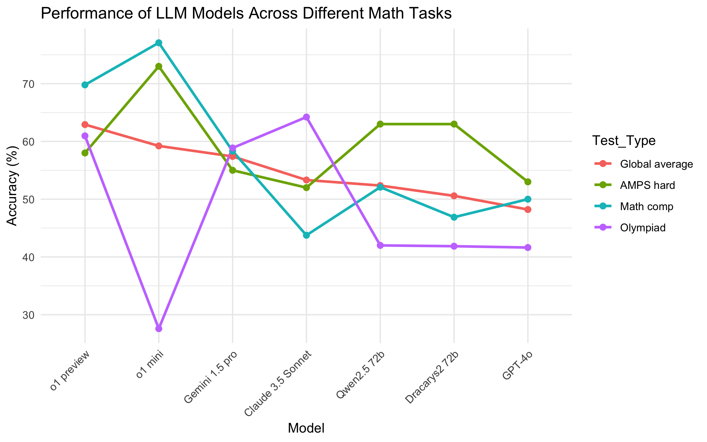

## 1. Introduction

&emsp; In recent years, we have seen a boom in artificial intelligence capabilities, specifically in the field of natural language processing. Through sequence-to-sequence modeling, we now have machines, called *large language models* (LLMs), which are capable of many tasks that require logical reasoning, i.e., intelligence. Unlike a typical search engine, LLMs are capable of synthesizing the data that they are trained on, allowing them to complete complex tasks using a variety of different ideas.

&emsp; However, there are clear limitations to our current systems, and it is unclear whether these limitations can be overcome without significant theoretical advancements. When tasked with solving mathematical problems, even the most advanced reasoning models often struggle to play with definitions in the way that a mathematician would. While they understand what should come next, they do not know why. Although chain-of-thought prompting can help mitigate this limitation, we have yet to see a model capable of effectively tackling advanced mathematical problems.

&emsp; There have been a variety of benchmarks developed to test AI; the figure below displays the results of some of the best models on a few common tests. One recent benchmark, FrontierMath [[2]](#4-references), which consisted of considerably more advanced problems, resulted in the best LLMs achieving only around 2% accuracy at best; however, it should be noted that each LLM was only given a single attempt at each problem. Overall, it appears that current LLMs are statistically incapable of efficiently solving technical mathematical problems.



&emsp; Thus, in this essay we explore how this difficulty can be overcome by building an *autoformalizer*. This is a computer program designed to interpret imprecise logic written in English and convert it into precise formal representations within a type-theoretic framework, e.g., Lean. Lean is a proof assistant and programming language that ensures absolute rigor in mathematical reasoning, allowing users to write formal proofs with zero errors, as it verifies every step against strict logical rules. The resulting code can then be executed, verified, and formally proven. Furthermore, an autoformalizer would have much broader applications outside of checking synthetically generated theory, as it would be capable of verifying any piece of written math. However, the existence of such a philosophical object seems virtually impossible, as human language is not exact, which means we would need to create an approximation of it.


## 2. Societal impact

&emsp; Before we dive into applications, let us briefly discuss what an autoformalizer is as well as what it could do. At its core, it serves as a math checker for any theorem, equation, or related mathematical statement. An autoformalizer would not make mistakes and could detect any written error with precision. However, this simplistic perspective overlooks the inherent interpretability of most human writing (except in highly precise mathematics), making it theoretically impossible to create. Thus, we are interested in a machine which is capable flagging any *possible* mathematical mistake, whether it be due to a lack of clarity in the writing or a genuine error.

&emsp; In what follows, we give a series of examples of how this technology could be applied to real-world scenarios for the betterment of society. We begin with simple, concrete examples, and then we discuss more open-ended possibilities.


###### Example 1: Mars climate orbiter mishap

&emsp; In 1999, a \$327.6 million spacecraft was lost due to a unit conversion error [[6, 7]](#4-references). The software which controlled the ship's thrusters was built by Lockheed Martin, who assumed the input to be in imperial units (pound-force seconds), while NASA’s Jet Propulsion Laboratory used metric units (newton-seconds) when inputting thruster maneuvers. This caused the thrusters to underfire, leading to the spacecraft coming too close to Mars, where it either disintegrated or skipped off into space. What if there were people in it? An autoformalizer could have easily caught this unit mismatch.


###### Example 2: Knight Capital trading loss

&emsp; In 2012, the high-frequency trading firm Knight Capital lost \$440 million because of a software error [[12]](#4-references). After updating some but mistakenly not all of their servers, Knight Capital's trading code had a logical error in it which resulted in repeatedly buying stocks high and then selling them low. An autoformalizer could have ensured that the computer code matched the intended trading algorithm, flagging the error before trading commenced.

&emsp; More broadly speaking, financial institutions and corporations must adhere to strict regulatory requirements. These often involve intricate mathematical models for risk assessment, tax calculations, or financial projections. Errors in these computations can result in substantial fines, reputational damage, or even financial collapse. An autoformalizer could flag inconsistencies in a given set of models, ensuring that calculations are both accurate and compliant with regulations.


###### Example 3: Civil engineering

&emsp; The failure of infrastructure projects, such as bridges or dams, can often be traced back to calculation errors during the design phase. For example, in 2018, the Morandi Bridge in Genoa, Italy, collapsed due to an underestimation of the stress on its stay cables, a design flaw that led to a catastrophic failure that killed 43 people [[9]](#4-references). An autoformalizer could rigorously check all engineering calculations, ensure consistency in models, and help prevent such disasters.


###### Example 4: Automated paper review

&emsp; Academic, and, in particular, mathematical, manuscripts frequently take months to properly review. However, an autoformalizer would be able to instantly check that all of the underlying mathematical theory is correct. Then, human reviewers could focus on the impact of the ideas instead of being burdened by small details. This will become increasingly important as AI helps write more papers, or even entire ones on its own, creating a need for a quick way to review this growing volume of information. Furthermore, I believe that this could help decentralize academia, creating a democratic process for publishing papers, where any mathematical paper could be put online with the reader knowing everything in it is logically sound.


###### Example 5: Mathematical superintelligence

&emsp; An autoformalizer could generate an extensive repository of mathematics in Lean, providing a foundation to train mathematically super-intelligent AI. In particular, a specialized AI trained in this manner would likely outperform a general-purpose system in mathematical reasoning. To illustrate this, let us consider the analogy of chess: Would artificial general intelligence really outperform a dedicated chess engine in the game? The same logic applies here—specialization often trumps general intelligence in specific domains. By leveraging formalized mathematics, we could create an unparalleled tool capable of exploring research areas currently limited by human cognition.

&emsp; An example of such intelligence would be a *mathematics mining machine*. I am quite curious about the possibility of a computer program that could, without interacting with physical reality, produce interesting mathematical results. A lot of what we know and are interested in is driven by physics, allowing us to move between the real and the abstract when creating models. Conversely, I aim to explore ways to quantify the significance of theorems that lack physical meaning.

&emsp; A mathematically superintelligent AI could profoundly impact society. While mathematical research appears to have slowed, it is unlikely that the field’s full potential has been realized. This is important: Mathematics often inspires innovation in other domains and catalyzes technological advances. Furthermore, we currently live in a dark age, where we more preoccupied with *proving* things are true, rather than *understanding* the meaning of existing ideas. Such AI would allow us to instantly know whether or not something is true, why it is true, and analyze the broader societal importance of mathematical constructs.

&emsp; Finally, let us briefly consider the story of Alexander Grothendieck and Jean Dieudonné. When writing the Éléments de Géométrie Algébrique (EGA) [[4]](#4-references), a foundational mathematical text in algebraic geometry, Grothendieck relied upon a distinguished mathematician and former member of the Bourbaki group, Dieudonné, to refine and organize his writing [[11]](#4-references). Grothendieck's radical and creative nature was complimented by the mature writing of Dieudonné, allowing him to efficiently place his constructions into a mathematically rigorous, formalized text. I personally benefitted from this, as I found reading the EGA to be much easier than some of Grothendieck's earlier writing, such as his Tôhoku paper [[3]](#4-references). Perhaps at some point we will all be empowered to be more imaginative like Grothendieck, relying upon AI to test our ideas in a rigorous setting.


## 3. Creating an autoformalizer

&emsp; An autoformalizer, practically speaking, cannot be created, and therefore would have to be approximated. Currently, the best known approximators are neural networks, and hence we will build our autoformalizer as an optimized LLM. In the sequel, let us limit ourselves to the case of an approximating machine that can translate from English to Lean 4 [[5]](#4-references).

&emsp; We break this section down into three pieces. The first is focused on assembling a foundational dataset for our autotranslator, which is done by converting Lean code into written English. Then, we contemplate how to go back from Lean into English to create an autoformalizer. Finally, we discuss the creation of a formalized tree of mathematics.


###### Foundational dataset

&emsp; We will need a dataset of English-Lean pairs when building our autoformalizer. Current LLMs come with some inherent understanding of Lean, meaning they behave as a poor approximation of an autoformalizer. Hence, assuming our autoformalizer uses a pretrained LLM as its base, this English-Lean dataset will serve multiple purposes: fine-tuning, few-shot examples for prediction, and retrieval-augmented generation (RAG). Let us now consider two ways in which this dataset can be constructed.

&emsp; The classical way to create such a dataset is to write a script which translates mathematics from Lean to English using the underlying logic of Lean. This seems feasible, albeit laborious. Let us consider the following theorem:

```
theorem exists_infinite_primes (n : ℕ) : ∃ p, n ≤ p ∧ Prime p :=
  let p := minFac (n ! + 1)
  have f1 : n ! + 1 ≠ 1 := ne_of_gt <| succ_lt_succ <| factorial_pos _
  have pp : Prime p := minFac_prime f1
  have np : n ≤ p :=
    le_of_not_ge fun h =>
      have h₁ : p ∣ n ! := dvd_factorial (minFac_pos _) h
      have h₂ : p ∣ 1 := (Nat.dvd_add_iff_right h₁).2 (minFac_dvd _)
      pp.not_dvd_one h₂
  ⟨p, np, pp⟩
```

I wrote a Python script which uses template matching to take keywords and flip them around into sentence. For instance "Prime p" becomes "p prime". Here is an example output:

```
theorem exists_infinite_primes Let n be in ℕ. Then there exists p, n ≤ p and p prime
  let p be a minimum factor of (n ! + 1)
  we claim n ! + 1 ≠ 1, because any factorial is positive
  we claim p prime, because any minimum factor is prime
  we claim n ≤ p. Indeed,
    assume n > p
      we claim p ∣ n !, because assume n > p
      we claim p ∣ 1, because a number only divides the sum if it divides each term 
      primes do not divide 1 and p ∣ 1
  finally, we have n ≤ p and p prime
```

The problem with this approach is *every single* keyword in Lean would need a template to allow the computer to parse it; my code only can parse a few limited statements so far. However, once completed, the English output can be input into an LLM, which will format it into a coherent and readable proof.

&emsp; A simpler approach involves directly inputting the Lean code into an LLM while using RAG to assist the LLM in understanding relevant keywords. While LLMs are not good yet at going from English to Lean, they are decently capable of translating Lean to English. If we simply take the above theorem in Lean and ask ChatGPT-4o to translate it, we get the following:

---

**Theorem.** For any natural number $ n $, there exists a prime number $ p $ such that $ n \leq p $.

*Proof.* Consider the number $ n! + 1 $, where $ n! $ is the factorial of $ n $. Let $ p $ denote the smallest prime divisor of $ n! + 1 $, which exists because every integer greater than 1 has a prime factor.

First, note that $ n! + 1 \neq 1 $ since $ n! \geq 1 $ implies $ n! + 1 > 1 $. Therefore, $ p $ is well-defined and satisfies the condition of being a prime divisor of $ n! + 1 $. By the definition of primality, $ p $ is a prime number.

Next, we claim that $ n \leq p $. Suppose, for contradiction, that $ p < n $. Since $ p $ divides $ n! + 1 $ and $ n! $ is divisible by all integers less than or equal to $ n $, $ p $ must also divide $ n! $. This implies $ p \mid (n! + 1 - n!) = 1 $, contradicting the fact that no prime number divides 1. Hence, $ n \leq p $.

Thus, $ p $ satisfies $ n \leq p $ and is prime. Therefore, such a $ p $ exists, completing the proof. Q.E.D.

---

We see that, although the proof is wordy, it is logically correct. I am currently writing a script which takes every single statement in Mathlib4 and creates an English counterpart for it. (Or multiple counterparts in order to diversify the training dataset.)


###### Approximating an autoformalizer

&emsp; Our foundational training dataset will enable us to develop a model with some basic syntactic understanding of Lean. However, this alone will be far from sufficient, and the program will likely require multiple specialized components. For example,generative adversarial networks (GANs) or an actor-critic method could be utilized specifically to translate core statements—such as theorems and lemmas—from English into Lean. Following this, a guided reinforcement learning (RL) approach, similar to the method DeepMind used to solve IMO problems formalized in Lean [[1]](#4-references), could be employed to construct the proof itself. Throughout this process, retrieval-augmented generation (RAG) would be utilized to provide the network with relevant Lean statements to enhance its understanding.

&emsp; By supplying the RL system with the English proof, its effectiveness should increase significantly, as shown in recent works creating Lean workbooks and large-scale problem datasets [[14]](#4-references). Notably, while DeepMind's program struggled with certain problems—taking days to solve some and failing on others—current RL techniques may still hold promise. A guided variant of RL, when coupled with precise English-to-Lean translation, could enable effective formalization of mathematical statements and proofs.


###### A formalized tree of mathematics

&emsp; A key goal is to create a self-correcting tree of formalized mathematics that integrates citations across the literature into a unified, searchable framework—essentially a "Google of math and logic." This tree would allow users to query, verify, and apply mathematical concepts with precision, accelerating and insuring the correctness of industrial applications anywhere applied mathematics is found. Errors in the tree would trigger automatic reviews of dependent results, with tools tracing the impact of corrections and version control ensuring transparency. This dynamic system would remain accurate and up to date, as an ever-evolving tree of mathematics.


## 4. References

1. DeepMind. "AI achieves silver-medal standard solving International Mathematical Olympiad problems," 2024. [Link](https://deepmind.com/discover/blog/ai-solves-imo-problems-at-silver-medal-level/){:target="_blank"}

2. Glazer, Elliot, et al. "FrontierMath: A Benchmark for Evaluating Advanced Mathematical Reasoning in AI," 2024. [Link](https://arxiv.org/pdf/2411.04872){:target="_blank"}

3. Grothendieck, Alexander. "Sur quelques points d'algèbre homologique." *Tohoku Mathematical Journal*, vol. 9, no. 2, 1957, pp. 119–221. [Link](https://projecteuclid.org/euclid.tmj/1178244839){:target="_blank"}

4. Grothendieck, Alexander, and Jean Dieudonné. "Éléments de géométrie algébrique." *Publications Mathématiques de l'IHÉS*.

5. Lean Community. "Lean 4 Documentation," 2024. [Link](https://leanprover.github.io/lean4/doc/){:target="_blank"}

6. Mars Climate Orbiter Mishap Investigation Board. "Mars Climate Orbiter Mishap Investigation Phase I Report," 1999. [Link](https://llis.nasa.gov/llis_lib/pdf/1009464main1_0641-mr.pdf){:target="_blank"}

7. Mars Climate Orbiter Mishap Investigation Board. "Report on Project Management in NASA: Lessons Learned from the Mars Climate Orbiter Failure," 1999. [Link](https://discovery.larc.nasa.gov/PDF_FILES/mars_climate_orbiter_phaseII.pdf){:target="_blank"}

8. NASA. "Mars Climate Orbiter (1998-073A) Spacecraft Details." NSSDC Master Catalog, 1998. [Link](https://nssdc.gsfc.nasa.gov/nmc/spacecraft/display.action?id=1998-073A){:target="_blank"}

9. National Transportation Safety Board. "Collapse of the Morandi Bridge in Genoa, Italy," 2018. [Link](https://www.ntsb.gov/investigations/AccidentReports/Reports/HAR1901.pdf){:target="_blank"}

10. OpenAI. "Solving (some) formal math olympiad problems," 2022. [Link](https://openai.com/index/formal-math/){:target="_blank"}

11. Ribenboim, Paulo. "The Grothendieck I Knew: Telling, Not Hiding, Not Judging." *Notices of the American Mathematical Society*, vol. 66, no. 7, 2019, pp. 1069–1075. [Link](https://www.ams.org/journals/notices/201907/rnoti-p1069.pdf){:target="_blank"}

12. Securities and Exchange Commission. "SEC Charges Knight Capital With Violations of Market Access Rule," 2013. [Link](https://www.sec.gov/news/press-release/2013-264){:target="_blank"}

13. U.S. Department of Transportation. "Knight Capital Americas LLC: Order Instituting Administrative and Cease-and-Desist Proceedings," 2013. [Link](https://www.sec.gov/litigation/admin/2013/34-70694.pdf){:target="_blank"}

14. Ying, Huaiyuan, et al. "Lean Workbook: A large-scale Lean problem set formalized from natural language math problems," 2024. [Link](https://arxiv.org/abs/2406.03847){:target="_blank"}

