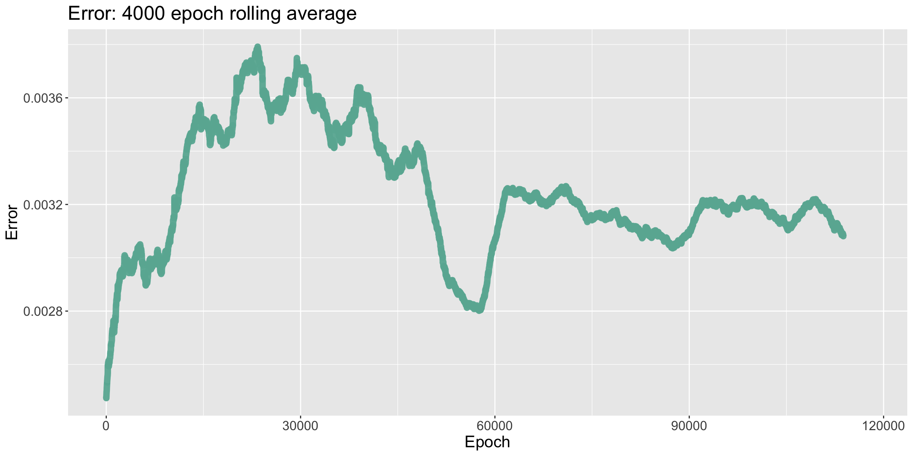
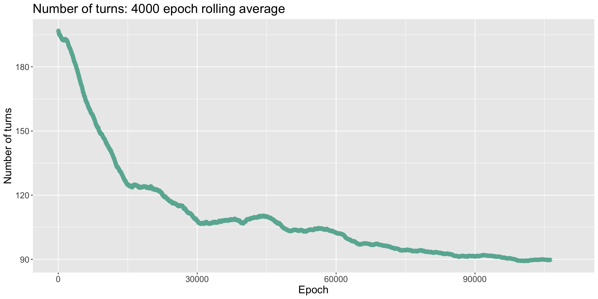

*Disclaimer.* &nbsp; This project was my first substantial effort using PyTorch and deep learning, so certain parts remain less polished. In particular, I leveraged a supervised learning setup with small batch sizes, which contrasts with the predominant reinforcement learning approaches. Nonetheless, my untraditional approach seemed to work relatively well.

## 1. Introduction

&emsp; Catan is a strategic board game where players attempt to control the resources on the board in order to score points. Throughout the game, players take turns rolling dice, trading resource cards, purchasing development cards, and building roads and settlements, until they reach 10 points. There are many luck-based elements to the game, such as who goes first, the distribution of the dice rolls, and the development card shuffle. Hence, it is often difficult to evaluate a given position, especially when players are pursuing contrasting strategies.

&emsp; When playing online with friends, I noticed that the AI bots were atypically poor, even at their most difficult setting. Instead of developing long-term strategies, the bots pursued simple ones, such as drawing lots of development cards. The purpose of this project is to train a competitive Catan playing neural network; I hoped that my network would be able to make moves that a professional Catan player would categorize as "strong" or "intelligent".

&emsp; A notable example of training a neural network through self-play is G. Tesauro's TD-Gammon developed during the 1990s [[12]](#7-references). His networks consisted of less than 5 hidden layers and 100 hidden units—networks that are orders of magnitude smaller than many modern networks. During training, each turn it would predict the win probability for each possible move, and then select the move with the highest overall win probability. His program then backpropagated the game result using a temporal-difference (TD) method, meaning that instead of comparing each individual prediction with the result, they would be compared successively to each other to minimize their differences. This approach showed remarkable success: An initial model achieved a strong intermediate ranking after 200,000 training games, and an enhanced model achieved a level of play only matched by the world's best players after 1,500,000 training games.

&emsp; Another interesting example of learning through self-play is the work of DeepMind Technologies in the 2010s on Atari video games [[7]](#7-references), chess, and Go [[9]](#7-references). They took advantage of greatly increased computer power and new image recognition methods, e.g., modern convolutional neural network architectures. This enabled the creation of a single model capable of playing multiple Atari games, along with a state-of-the-art chess playing bot, and, for the first time, a super-human level Go playing program. When training their networks, they utilized various Monte-Carlo tree search (MCTS) algorithms, which would randomly choose moves (or board positions) that had not been visited many times before in order to approximate a Q-function.

&emsp; My approach to Catan directly builds on the research discussed above. I trained a residual neural network to predict whether a given player will finish first, second, or third, using a TD-method combined with a simplified MCTS algorithm. I tested this approach in two settings: (1) with the board tiles and numbers fixed and (2) without the board fixed. In both trials, I disabled player-to-player trading while limiting the number of players to 3; I hope to train a more general model in the future.

&emsp; In case (1), I created a network that won each game in an average of 73 dice rolls. Other analyses suggest the average number of rolls to win being in the range 60–70—for instance, in [[1]](#7-references), they counted an average of 71 rolls in a four person game. Hence, 73 rolls imply my model is a little slow, as a three person game should finish more quickly than a four person game. The slight increase in the number of rolls could be attributed to disabling player-to-player trading. I also found that, by personally playing my model, it was better than an amateur player, but the network still struggled with late game strategy. It seems capable of occasionally winning, albeit not at a high rate. I think this can be fixed by employing more MCTS rollouts during the end game.

&emsp; In case (2), the network was a bit slower, winning each game in an average of 86 dice rolls. In turn, this reduced the model from playing at an intermediate level and challenging for wins to a beginner level. Two possible ways to improve this model are either creating human engineered features for the model to interpret (e.g., how many resources each settlement position borders), or creating a larger model with additional training time. The former seems simpler because the latter would likely require much more computational power than I had available. 

## 2. Catan implementation

&emsp; I coded my own version of Catan in Python to utilize PyTorch. The code is distributed across five files and available on my GitHub repository: 

<ul style="list-style-position: outside; padding-left: 25px;">

<li><b>player.py</b> contains the player class. This manages for each player their resource and development cards, settlements and cities, etc. Notably, it contains an array of the player's predictions, i.e., the outputs from the network made each move, which is utilized when updating the network's weights.</li>

<li><b>board.py</b> compromises of the board class. It is responsible for generating the board positions and development card ordering. It also contains maps corresponding each position to an integer so we can translate board information to the input tensor for our network.</li>

<li><b>game.py</b> holds the game class. It handles almost all gameplay. In particular, the game class contains methods which allow our network to interact with the board by generating a tensor containing the board and a player's possible moves, then feeding this tensor to our model in order to choose a move.</li>

<li><b>network.py</b> contains the CatanNetwork and ResidualBlock classes. The CatanNetwork is a residual neural network built out of ResidualBlock objects.</li>

<li><b>training.py</b> is composed of the training procedure. In it are the network and the optimizer, and it is responsible for updating the network's parameters.</li>

</ul>

&emsp; Here is the call graph:

&emsp; I programmed the board based on the notion of sets containing different vertices. Each corner of a tile is considered a vertex (or settlement position), each road and trading port is defined by two vertices, and each tile is defined by six vertices. This simplified calculations for where a player could build a road or settlement, the length of their longest road, and so on.

&emsp; Each turn, the game generates an input tensor for the network. This consists of the known board information for the current player along with their possible moves. For each move, I then created a temporary tensor containing the board information and a single 1 in the moves portion indicating this move. Inputting this tensor to the network is philosophically equivalent to asking it "What is the predicted finishing position given this board and this move?". If a MCTS move was not chosen that turn, cf. [§4](#4-training-procedure), the program then chose the move with the best given move position.

&emsp; One thing that helped with training was rotating the input tensor with respect to each player's information, e.g., each player would see their statistics listed first, then the player taking the following turn, and so on. I found it difficult to train the network effectively without this, even if the network was given the current player number.

## 3. Network architecture

&emsp; The CatanNetwork is a 10 layer feedforward residual neural network consisting of a fully connected input layer, 4 residual blocks [[3]](#7-references), and a fully connected output layer. Specifically, the input layer maps our 1782 input features linearly to 500 neurons. Each residual block performs a 500 $ \times $ 500 linear transformation and ReLU, another 500 $ \times $ 500 linear transformation and ReLU, adds the input (also known as a skip connection), then performs another ReLU. Finally, our output linearly maps our 500 new features to a single output value, which is supposed to correspond to what position the player is expected to finish. In total, the CatanNetwork has 2,896,001 parameters.

&emsp; I tested a variety of architectures before settling on the CatanNetwork. I started with some simple models: single layer networks with 50, 100, or 1100 neurons. I found these models to be too unstable and to suffer from catastrophic forgetting. I also tried other naive configurations, such as 5 fully connected layers with 1000 neurons each. These all seemed to lack the quickness to converge and ability not to forget that the CatanNetwork possessed.

&emsp; One important hyperparameter was the number of neurons in the hidden layers. I chose 500 to create a sufficiently large network while also prioritizing training time. I discuss in [§4.4](#44-adamw) that, by exploiting weight decay, having too large of a network is more of a concern than too small. I hoped the CatanNetwork would be large enough, although now I believe a bigger model is needed. Thus, with the chosen number of neurons, the network was able to play a game of Catan approximately every 4 seconds, which translates to 22,500 games per day. 

## 4. Training procedure

&emsp; In this section, I describe the ideas that were utilized in training my bot. First, in [§4.1](#41-temporal-differences), I explain why I utilized temporal-difference methods and how they are implemented in my code. Subsequently, in [§4.2](#42-monte-carlo-tree-search), I detail my simplified Monte-Carlo tree search algorithm. Next, in [§4.3](#43-criterion-and-gradient-clipping), I explain my choice of criterion, a smooth L1 loss, and why gradient clipping was necessary. In [§4.4](#44-adamw), I justify using the AdamW optimizer. Finally, in [§4.5](#45-batch-size-and-learning-rate), I discuss how adjusting the batch size and learning rate affected training.

##### 4.1. Temporal-differences

&emsp; Temporal-difference (TD) methods suggest that, instead of computing the loss as the difference between the model predictions and the outcome of the game, we should compute the loss as the differences between successive predictions. In other words, we have the computer check to see if it has indeed gained an advantage. This incentivizes our model to predict outcomes that do not change significantly each turn, forming a "smooth" curve until settling upon the real score of the game. In practice, TD methods are easy to implement while often having drastic effects on model training.

&emsp; For example, suppose that we compute the loss only using the final game scores. Recall that we would like to predict whether the player will finish in first, second, or third place when playing Catan. Let network A consistently predict that our player is going to finish in third place each turn, whereas network B alternates between predicting first place and third place. If our player finishes in second place, both models would be penalized the same compared to the game outcome: each turn they had an error of 1. However, it makes little sense for model A to keep jumping between places first and third: why not take their average and choose second? Whereas, for model B, it could be that our player luckily gained a place at the end of the game due to the actions of another player, and hence the increase from third to second. 

&emsp; TD methods have shown to be successful in a variety of game playing tasks. One of the first implementations was Samuel's checkers program, where he created a program which could play checkers better than himself [[8]](#7-references). TD methods were abstracted by Sutton in [[11]](#7-references), where he defined his TD-lambda; furthermore, he showed that, with certain natural constraints, TD-lambda is capable of modeling arbitrary training sets. Likewise, Tesauro named his program TD-gammon in reference to the importance of TD methods when training it [[12]](#7-references). 

&emsp; I exploited TDs as follows. Each turn, the program records the prediction the current player has made for their chosen move; this yields one prediction vector for every player. Once the game has concluded, for each player, I construct a labels vector by copying and then shifting the predictions vector one coordinate over—forgetting the first prediction made—and inserting the final game score in the final position. Effectively, this compares subsequent predictions to each other, and the final prediction to the final game score. Finally, I compute the loss, cf. [§4.3](#43-criterion-and-gradient-clipping), and backpropagate it.

##### 4.2. Monte-Carlo tree search

&emsp; Monte-Carlo tree search (MCTS) methods are based on the idea of infrequently having a model choose random moves, testing the accuracy of the model's predictions for otherwise ignored moves. Here, the model may choose one or many random moves in order to approximate a Q-method. Ideally, this prevents the model from getting stuck in a non-optimal local minimum. 

&emsp; One previous implementation of MCTS was by the researchers at Deepmind when developing AlphaGo [[9]](#7-references). Their method treated each board position as a node in a large game tree, storing the action value, visit count, and prior probability for each possible action, and used repeated exploration of underrepresented moves alongside simulations for a more comprehensive understanding. However, attempting such a detailed approach for Catan on a local workstation is exceedingly difficult—random tile and number generation, coupled with the large branching factor, rapidly expands the search space and demands more compute power than most non-distributed systems can handle. Consequently, I settled on a simpler scheme that occasionally picks random moves to maintain some exploration, albeit without the exhaustive coverage of a full MCTS.

&emsp; I adopted a simplified MCTS-like mechanism by assigning a 1/1000 probability for any given move to be selected randomly; once a random choice was made, the rest of the game proceeded deterministically. To avoid corrupting the training data, I also discarded all previous predictions in that sequence, reasoning that they no longer applied to the altered trajectory. Though one might argue for preserving some of these earlier predictions, I found that the 1/1000 sampling frequency strikes a practical balance: it yields roughly a 30% chance of introducing randomness in the initial placement phase (e.g., first settlements or roads), and still spreads out enough random moves in later stages to diversify the training data.

&emsp; A drawback of this approach is that it can trigger abrupt spikes in the training error. When the model veers into unfamiliar game states due to a random move, it may provide highly inaccurate final predictions, sharply increasing the loss. Because such events are infrequent, there are relatively few additional data points to offset their impact, amplifying the resulting error spikes. To mitigate these effects, I employed several techniques—lowering the learning rate, scaling up the batch size, switching to a Huber loss, and clipping gradients—as outlined in subsequent sections.

##### 4.3. Criterion and gradient clipping

&emsp; I employed a smooth $ L^1 $ (Huber) loss function to train the CatanNetwork, which behaves quadratically for errors less than 1 and linearly for errors larger than 1. This design helps ensure that grossly inaccurate predictions do not dominate training; for instance, if the model incorrectly predicts 6th place instead of 1st, the resulting penalty is a tolerable 4.5 rather than 12.5.

&emsp; I also adopted gradient clipping, bounding the $ L^2 $ norm of the gradients at 0.1. This prevents the occasional large gradients—sometimes 40x the usual magnitude—that arise due to MCTS-generated outlier states from “untraining” the entire model. Without clipping, a single random spike in loss could negate weeks of optimization progress.

&emsp; Interestingly, higher losses sometimes coincided with stronger in-game performance. Because the temporal-difference (TD) method emphasizes final outcomes, shorter games mean each final prediction drives a larger fraction of the total loss. In other words, playing more efficiently can paradoxically inflate error. One possible remedy is to normalize the final prediction relative to game length, though preliminary attempts at doing so introduced their own volatility. Further experimentation could refine this approach.

##### 4.4. AdamW

&emsp; Adam, short for adaptive moment estimation, was introduced by D. Kingma and J. Ba in [[5]](#7-references). Unlike, for example, stochastic gradient descent with momentum, Adam uses computationally efficient estimations of the first and second moments in order to compute an adaptive learning rate. This acts as a form of automatic annealing, allowing it to often converge quicker than, for example, SGD, which requires the user to manually adjust the step size. Mathematically, Kingma and Ba proved that Adam has an average $ O(\sqrt{T}) $ online regret bound for convex optimization, meaning it indeed converges if the loss functions are convex. Practically, they showed that Adam converged quicker on image recognition tasks than many other optimizers. Adam has been popular in training large language models, cf. [[4]](#7-references)

&emsp; AdamW is a modified version of Adam that utilizes weight-decay to prevent unbounded network parameter growth. I. Loshchilov and F. Hutter proved in [[6]](#7-references) that, unlike for SGD, $ L^2 $-regularization and weight-decay are not equivalent for Adam. Hence, they introduced a version of Adam which uses decoupled weight decay called AdamW. They showed that it performed better than Adam on image recognition tasks during later stages of training, i.e., after 1000 epochs, while both lagged behind SGD. This is in stark comparison to Kingma and Ba's experiments, which only tested their optimizer over 200 epochs. This is important for my Catan model, as the number of epochs will reach more than 100,000. 

&emsp; For these reasons, I utilized AdamW when training my model. I set the initial learning rate to 5e-5, then I decreased it by a multiple of 5 each time the model stopped learning. The rest of the AdamW learning parameters, $ \beta_1, \beta_2, \epsilon $, etc., I left to be the default values as given by Loschilov and Hutter in [[6]](#7-references).

##### 4.5. Batch size and learning rate

&emsp; Increasing the batch size and decreasing the learning rate, on the surface, have similar effects when training a model: each slows down learning while decreasing the volatility of the learning steps. This has been particularly shown to be true in the case of image recognition, cf. [[10]](#7-references). I used both techniques. I began training with a batch size of 1 game and a learning rate of 5e-5. When training stagnated, I decreased the learning rate to 1e-5 or doubled the batch size. I only decreased the learning rate once; meanwhile, I found doubling the batch size from 1 to 2 and then from 2 to 4 caused improvements in performance each time. This could be because AdamW has an adaptive learning rate, which likely caused further decreases to not yield significant gains.

## 5. Results 

&emsp; This section is split into two parts. First, in [§5.1](#51-a-fixed-board-network), I detail training a network which only models a fixed board position. Next, in [§5.2](#52-a-general-network), I describe training a more general network which does not require the board to be fixed. Note that the average number of turns to win reported during training are slightly higher than my estimation, as MCTS is enabled, adding randomness to the network's gameplay. All training was done on an Intel i9-13900K processor (24 cores), because training on a GPU would have been slower due to the lack of parallelism in my code.

##### 5.1 A fixed board network

&emsp; My first model was trained by fixing the board, i.e., the resources, roll numbers, and ships were all fixed. I found this network to train well and achieve an intermediate level of play. The training procedure was as follows: I started with a learning rate of 5e-5 for 38,000 epochs, which I decreased to 1e-5 until epoch 53,000; finally, I increased the batch size to 2 for the remainder of the training. The network was trained for a total of 117,750 epochs.

&emsp; As discussed in [§4.3](#43-criterion-and-gradient-clipping), the model's error is partially inversely correlated with the number of turns taken to win the game. This was seemingly one of the major drawbacks of using TDs: during the late stages of training, the model would struggle to optimize error, as attempts to do so could end up increasing it. The later drops in error can be attributed to increasing the batch size, which in turn averages out the spikes that can occur due to my MCTS algorithm.

&emsp; The number of turns the model took to win each game quickly decreased until it flatlined, winning each game in around 85 turns. I then decreased the learning rate, which brought it down to winning in around 77 turns. Lastly, when I doubled the batch size, the number of tursn to win started to drop, but then shot back up. Watching the network improve and then forget during the fine tuning stage of training suggests that a larger model is needed.

&emsp; When I played against this model, I noticed that it excelled at early game strategy. Its initial settlement placements were strong and took me by surprise. During the middle game, I was on my toes—the model kept pace with me, and I struggled to outscore it. However, during the end game the model began to seriously struggle. When I built settlements in positions where it wanted to settle, it would build a road to that settlement, then realize it could not settle there. The network likewise had a difficult time capitalizing on new resources: while I was able to take advantage of all the resources I was receiving, quickly building settlements and cities, it seemingly stagnated. The final scores were 10, 8, and 7. 

##### 5.2 A general network

&emsp; My second model was trained on arbitrary board positions, i.e., the resources, roll numbers, and ships were all shuffled each game. This network struggled to play at a high level, which I simply attribute to not having enough training data and parameters to model the task at hand. I believe a general model could be created with more computational power. The training procedure was as follows: I started with a learning rate of 5e-5 for the first 48,000 epochs, when I decreased the learning rate to 1e-5; next, at epoch 63,000, I doubled the batch size to 2; and finally, at epoch 95,000, I again doubled the batch size to 4. The network was trained for a total of 102,300 epochs.

&emsp; The error of the model again grew proportionally to the number of turns taken to win the game. The volatility of the error early on compared to its relative stability later is a consequence of increasing the batch size.

&emsp; This time, the number of turns taken to win decreased until it flatlined at around 112 turns. I decreased the learning rate, bringing it to win in ~104 turns. I then increased the batch size to 2 games, causing it to win in ~91 turns; and finally, the batch size was increased to 4 games, causing it to win in ~89 turns.

&emsp; It becomes apparent why this model struggles so much when compared to the fixed board model. The fixed board model already had a difficult time playing against me when I settled in places it had not seen before. Now, the inherent level of randomness the model was seeing likely made any major pattern detection difficult. I was hoping for the opposite effect: by playing many contrasting board positions, the model would have the chance to better understand and adapt to my own settlement strategies. Perhaps this is just a case where further training is necessary.

&emsp; This also demonstrates a specific area where our algorithm might struggle. While it is extremely good at fixed board positions, as it can treat the game like a search tree (e.g. chess openings), randomizing the board very much complicates this search. The question then becomes "How can we make this shuffled board not appear...shuffled?" One idea that I had was to add additional input features, such as the total number of resources bordering each settlement location. This could eliminate the possibility for the sublime moves that my fixed board model was making, or it could simply guide the model to making better decisions.

## 6. Conclusion

&emsp; An intriguing possibility for future work is implementing a more rigorous Monte-Carlo tree search (MCTS) algorithm in a highly optimized C++ environment. By minimizing environment runtime overhead—through careful management of board state and move generation—and by parallelizing neural network calls, one could vastly increase the volume of playouts per second. Combined with an attention-based architecture to track relevant resources and positions (e.g., which tiles are most valuable or which roads are unblocked), a well-designed system might achieve super-human play on a modest local machine. The network would be able to systematically explore multiple branches of the game tree, refining its predictions and strategies over time in a manner reminiscent of AlphaZero’s approach to chess, but at a scale that is computationally feasible for single-workstation training.

&emsp; Of course, we must remember the sheer scale at which DeepMind’s models have been trained [[9]](#7-references). For instance, their chess bot, AlphaZero, reportedly leveraged around 5,000 TPUs in parallel over approximately nine hours. Even accounting for potential advances in GPU efficiency, this represents thousands of hours of total compute—well over half a year’s worth of training on a single high-end workstation—while my model was trained in only about a week. Nonetheless, a carefully engineered C++ implementation could narrow this gap. By eliminating environment overhead, employing data structures that exploit concurrency, and integrating attention mechanisms in the neural network, an MCTS-based bot might be trained orders of magnitude more efficiently, enabling a far deeper exploration of the Catan game space and ultimately matching or surpassing human-level performance.

## 7. References

1. Alex Cates, *Board game breakdown: Settlers of Catan, the basics*, 2022. [Link](https://www.alexcates.com/post/board-game-breakdown-settlers-of-catan-the-basics)

2. Xavier Gastaldi, *Shake-Shake regularization*, 2017. [arXiv:1705.07485](arXiv:1705.07485)

3. Kaiming He, Xiangyu Zhang, Shaoqing Ren, and Jian Sun, *Deep residual learning for image recognition*, 2016 IEEE Conference on Computer Vision and Pattern Recognition (CVPR) (2015), 770–778. [arXiv:1512.03385](arXiv:1512.03385)

4. Jared Kaplan, Sam McCandlish, et al., *Scaling laws for neural language models* (2020). [arXiv:2001.08361](arXiv:2001.08361)

5. Diederik Kingma and Jimmy Ba, *Adam: A method for stochastic optimization*, CoRR (2014). [arXiv:1412.6980](arXiv:1412.6980)

6. Ilya Loshchilov and Frank Hutter, *Decoupled weight decay regularization*, International Conference on Learning Representations (2017). [arXiv:1711.05101](arXiv:1711.05101)

7. Volodymyr Mnih, Koray Kavukcuoglu, David Silver, Alex Graves, Ioannis Antonoglou, Daan Wierstra, and Martin Riedmiller, *Playing Atari with deep reinforcement learning* (2013). [arXiv:1312.5602](arXiv:1312.5602)

8. Arthur Samuel, *Some studies in machine learning using the game of checkers*, IBM Journal **3** (1959), no. 3.

9. David Silver, Aja Huang, et al., *Mastering the game of Go with deep neural networks and tree search*, Nature **529** (2016), 484–489. [Link](https://doi.org/10.1038/nature16961)

10. Samuel Smith, Pieter-Jan Kindermans, and Quoc Le, *Don’t decay the learning rate, increase the batch size* (2017). [arXiv:1711.00489](arXiv:1711.00489)

11. Richard Sutton, *Learning to predict by the methods of temporal differences*, Machine learning **3** (1988).

12. Gerald Tesauro, *Temporal difference learning and TD-gammon*, Communications of the ACM **38** (1995), no. 3.