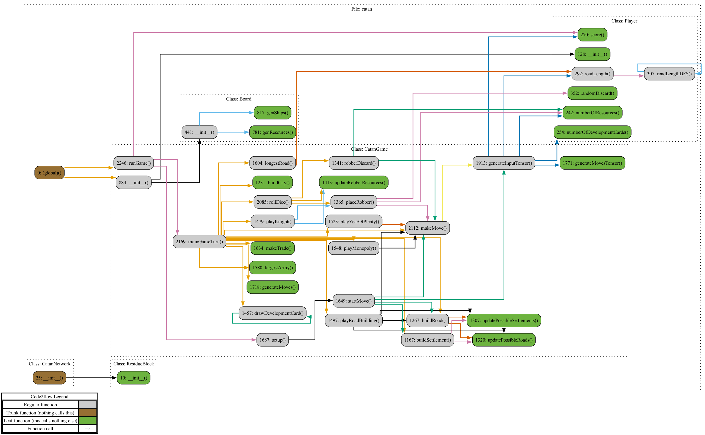
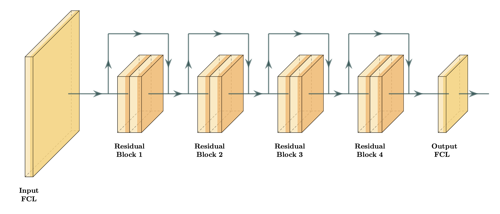

 
**Abstract.** &nbsp; I taught a neural network how to play the board game Catan using reinforcement learning via self-play. When training, I utilized both temporal-difference and Monte-Carlos tree search methods, along with a residual neural network structure. This resulting model achieved an intermediate level of play.

## Table of Contents

1. [Introduction](#1-introduction)
2. [Catan implementation](#2-catan-implementation)
3. [Network architecture](#3-network-architecture)
4. [Training procedure](#4-training-procedure)
5. [Results](#5-results)
6. [Future plans](#6-future-plans)
7. [References](#7-references)

## 1. Introduction

&emsp; Catan is a strategic board game where players attempt to control the resources on the board in order to score points. Throughout the game, players take turns rolling dice, trading resource cards, purchasing development cards, and building roads and settlements, until they reach 10 points. There are many luck-based elements to the game: who goes first, the distribution of the dice roll, the development card shuffle, etc. Hence, it is often difficult to evaluate a given position, especially when players are pursuing contrasting strategies.

&emsp; When playing online with friends, I noticed that the AI bots were atypically poor, even at their most difficult setting. Instead of developing long-term strategies, the bots would pursue simple ones, such as drawing lots of development cards. The purpose of this project is to train a competetive Catan playing neural network; we hope that our network can make moves that a professional Catan player would categorize as "strong" or "intelligent".

&emsp; An important example of training a neural network through self-play is G. Tesauro's TD-Gammon during the 1990s. His networks consisted of less than 5 hidden layers and 100 hideen units—networks orders of magnitude smaller than modern network. When training a model, each turn it would predict the win probability for each possible move, and then choose the move with the highest overall win probability. He then backpropogated the game result using a temporal-difference (TD) method, meaning that instead of comparing the predictions with the end result, they would be compared successively to eachother in an attempt to minimize their differences. This approach showed remarkable success: An initial model achieved a strong intermediate ranking after 200,000 training games, and an enhanced model achieved a level of play only matched by the world's best players after 1,500,000 training games.

&emsp; Another interesting example of learning through self-play is the work of DeepMind Technologies in the 2010s on Atari video games, chess, and go. They took advantage of greatly increased computer power and new image recognition methods, e.g., modern convolutional neural network architectures. This enabled to create a single model that was able to play multiple Atari games, along with a state of the art chess playing bot, and, for the first time, a super-human level go playing program. When training their networks, they utilized a Monte-Carlo tree search (MCTS) algorithm, where they would randomly choose moves that had not been visited many times before.

&emsp; My approach to Catan directly builds on the research discussed above. I trained a residual neural network to predict whether a given player will finish first, second, or third; this is done using a TD-method combined with a simplified MCTS algorithm. I tested this approach in two settings: (1) with the board tiles and numbers fixed and (2) without the board fixed. In both trials, I disabled player-to-player trading, and I hope to train a model which can trade in the future.

&emsp; In case (1), I trained a network which won each game in an average of 74 dice rolls. This is comparable to other analyses of Catan, which suggest the average number of rolls to win being in the range 60–70; for instance, https://www.alexcates.com/post/board-game-breakdown-settlers-of-catan-the-basics counted an average of 71 rolls in a four person game. The slight increase in number of rolls could be attributed to disabling player-to-player trading. I also found that, by personally playing my model, it was better than an amature player, but the network still struggled with late game strategy. It seems capable of occasionally winning, albeit not at a high rate.

&emsp; In case (2), I am currently training the network. At the moment, it wins each game in 106 dice rolls.

## 2. Catan implementation

&emsp; I coded my own version of Catan in Python in order to utilize PyTorch; you can find the code on my GitHub repository distributed amongst 5 files: 

<ul style="list-style-position: outside; padding-left: 25px;">

<li><b>player.py</b> contains the player class. This manages for each player their resource and development cards, settlements and cities, etc. Notably, it contains an array of the player's predictions, i.e., the outputs from the network made each move, which is utilized when updating the network's weights.</li>

<li><b>board.py</b> contains the board class. It is responsible for generating the board positions and development card ordering. It also contains maps corresponding each position to an integer so we can translate board information to the input tensor for out network.</li>

<li><b>game.py</b> contains the game class. It handles almost all gameplay. In particular, the game class contains methods which allow our network to interact with the board by generating a tensor containing the board and a player's possible moves, then feeding this tensor to our model in order to choose a move.</li>

<li><b>network.py</b> contains the CatanNetwork class. This is our residual neural network, which is built out of another class named ResidualBlock, cf. §3.</li>

<li><b>training.py</b> contains the training procedure. In it are the network and the optimizer, and it is responsible for updating the network's parameters.</li>

</ul>

&emsp; Here is the call graph:

&emsp; I programmed the board based on the notion of sets containing different vertices. Each corner of a tile is considered a vertex (or settlement position), each road and trading port is defined by two vertices, and each tile is defined by six vertices. This simplified calculating where a player could build a road or settlement, the length of their longest road, and so on.

&emsp; Each turn, the game generates an input tensor for the network. This consists the known board information for the current player along with their possible moves. For each move, I then created a temporary tensor containing the board information and only a single valid move. Imputting this tensor to the network is philosophically equivalent to asking it "What is likely finishing position given this board and this move?". If a MCTS move was not chosen that turn, cf. §4, the program then chose the move with the best given move position.

&emsp; One thing that helped with training was rotating the input tensor with respect to each player's statistics; e.g., each player would see their statistics listed first, then the player taking the following turn, and so on. I found it difficult to train the network effectively without this, even if the network was given the current player number.

## 3. Network architecture

&emsp; The CatanNetwork is a 10 layer feedforward, residual neural network consisting of a fully connected input layer, 4 residual blocks (**CITE** He et al.), and a fully connected output layer. Specifically, the input layer linearly maps our 1782 input features to 500 neurons. Each residual block performs a 500 $ \times $ 500 linear transformation and ReLU, another 500 $ \times $ 500 linear transformation and ReLU, adds the input (also known as a skip connection), then performs another ReLU. Finally, our output linearly maps our 500 new features to a single output value, which is supposed to correspond to what position the player is expected to finish. In total, the CatanNetwork has 2,896,001 parameters.

&emsp; I tested a variety of architectures before settling on the CatanNetwork. I started with some simple models: single layer networks with 50, 100, or 1100 neurons. I found these models to be too unstable and to suffer from catastrophic forgetting. I also tried other naive configurations, such as 5 fully connected layers with 1000 neurons each. These all seemed to lack the quickness to converge and ability not to forget that the CatanNetwork possesed. 

&emsp; Another variable to adjust was the number of neurons in the hideen layers. I chose 500 to create a sufficiently large network while also prioritizing training time. I discuss in §4 that, by exploiting weight decay, having too large of a network is more of a concern than too small; I hope the CatanNetwork is large enough. Thus, with the chosen number of neurons, the network was able to play a game of Catan approximately every 4 seconds, which translates to 22,500 games per day. 

&emsp; I am interested in experimenting with deeper architectures or with more hidden neurons in the future. Compare this to image recognition...

## 4. Training procedure

### Temporal-differences

&emsp; Temporal-difference (TD) methods claim that, instead of comparing each prediction by our network to the outcome of the game, we should penalize the differences between our predictions. This incentivizes our model to make predictions that do not change signifantly each turn, forming a "smooth" curve until settling upon the outcome of the game. Overall, TD methods are easy to implement while often having drastic effects on model training.

&emsp; For an example, suppose that we train on model solely on the outcome of the game. Recall that we would like to predict whether the player will finish in first, second, or third place when playing Catan. Let network A consistently predict that our player is going to finish in third place each turn, whereas network B alternates between predicting first place and third place. If our player finishes in second place, both of these models would be penalized the same compared to the game outcome: each turn they had an error of 1. However, it makes little sense for the model A to keep jumping between places first and third: why not take their average and choose second? Whereas, for model B, it could be that our player luckily gained a place at the end of the game due to the actions of another player, and hence the increase from third to second. 

&emsp; TD methods were classically studied by ... used in checkers player program...Then it later was studied by Sutton and implemented by Tesauro when training his TD-gammon.

### Monte-Carlos tree search

&emsp; Monte-Carlos tree search (MCTS) methods are based on the idea of infrequently having a model choose random moves, testing the accuracy of the model's predictions for otherwise ignored moves. In other words, according to some distribution, the model will randomly choose a move, then play out the rest of the game as normal. This move could be chosen on the first turn or the last. Ideally, this prevents the model from getting stuck in a non-optimal local minimum. 

&emsp; One previous implementation of MCTS is by the researchers at Google Deepmind when developing AlphaGo (**CITE**). Their method was based on treating the game of go like a search tree, where they would store the action value (i.e., how strong the move is), visit count, and prior probability for each move (e.g., "leaf"). This allowed the model to visit infrequently made moves with higher probability, followed by a playout in order to collect a sample action value. However, since in Catan the board is randomly chosen, the idea of designing a search tree relative to board position seemed inneffective. The sample space is patently too large. One could try to program a MCTS algorithm which takes into account how often each individual move occurs, regardless of the board position, but I decided upon something simpler. 

&emsp; I implemented a more naive version of MCTS: I gave each move a 1/1000 chance of being chosen randomly, and if a move was in fact selected, then the rest of the game was played out without a random move. I decided upon this probability as it provided a 30% chance that a setup move would be picked, i.e., one of the initial settlements or roads, along with a good distribution of middle to late game random moves, in practice.

### AdamW

&emsp; Adam, short for adaptive moment estimation, was introduced by D. Kingma and J. Ba in (**CITE**). Adam uses computationally efficient estimations of the first and second moments in order to compute an adaptive learning rate. This allows it to often converge quicker than, for example, stochastic gradient descent (SGD), which requires the user to manually adjust the step size. (**ADD DETAILS**)

&emsp; AdamW is a modified version of Adam with weight-decay. I. Loshchilov and F. Hutter observed in (**CITE**) that, unlike for SGD, $ L^2 $-regularization and weight-decay are not equivalent for Adam. Hence, they introduced a version of Adam which uses decoupled weight decay. (**ADD DETAILS**)

&emsp; For these reasons, I utilized AdamW when training my model. I set the initial learning rate to 5e-5, then I decreased it by a multiple of 5 each time the model stopped learning. The rest of the AdamW learning parameters, $ \beta_1, \beta_2, \epsilon $, etc., I left to be the default values as given in (**CITE** check epsilon).

## 5. Results 

&emsp; I found my network

## 6. Future plans

&emsp; 

## 7. References

