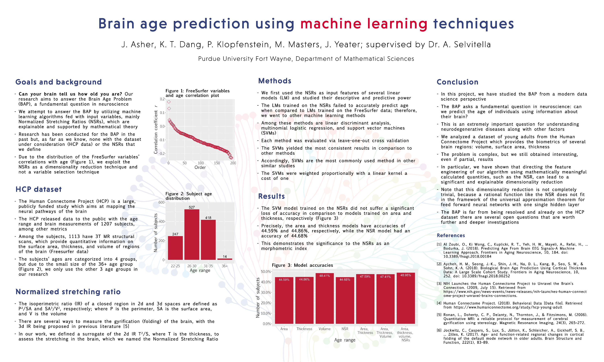

 

**Paper:** Asher, Justin; Tan Dang, Khoa; and Masters, Maxwell (2020) "A Differential Geometry-based Machine Learning Algorithm for the Brain Age Problem," *The Journal of Purdue Undergraduate Research*: Vol. 10, Article 40. [Link](https://docs.lib.purdue.edu/jpur/vol10/iss1/40/){:target="_blank"}

&emsp; Can your brain tell us how old you are? Our study aimed to provide a new morphometric index for studying aging in the brain. In particular, we introduce a *normalized stretching ratio* (NSR)

$$
\text{Thickness}^2 / \text{Surface area},
$$

an isoperimetric ratio, as a dimensionality reduction technique. 

Our study aimed to find a new method for predicting the age of a subject from their brain biometrics (brain age problem). We utilized an isoperimetric-type ratio $ T^2/A $, where $ T $ is the membrane thickness and A is the surface area, for each region of the brain. This was done to create an explainable model and as a dimensionality reduction technique. We then trained a multivariable regression model on the ratios, but it failed to preserve the prediction accuracy of the multivariable regression model trained on the area and thickness data. Therefore, we tried other modeling techniques, utilizing a multinomial logistic model. When compared to the multinomial logistic model trained on the thickness and area data, the multinomial logistic model trained on the ratios preserved, and improved, prediction accuracy. Therefore, the isoperimetric-type ratios can be used as an explainable dimensionality reduction technique for modeling age using brain biometrics.